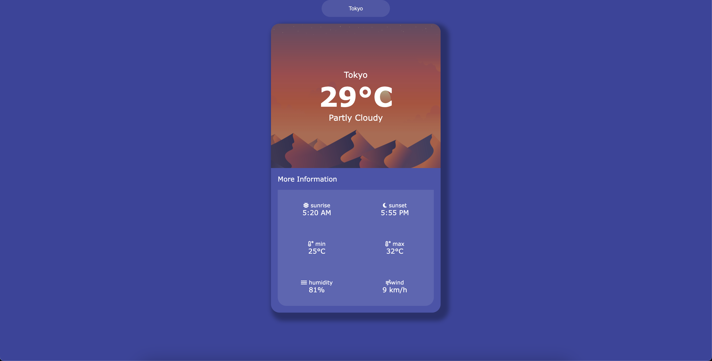

## Weather Viewer - Angular Project
This is an Angular project that allows users to search and view weather information for cities worldwide. The application utilizes the real-time weather forecast API to fetch weather data.

## Prerequisites
Before getting started, make sure you have the following prerequisites installed on your system:

Node.js (v14.x or higher)
Angular CLI (v12.x or higher)

## Installation
Follow these steps to install and run the project:

1. Clone the repository to your computer:

    git clone https://github.com/erickyfigueiredo/weather.git
    cd weather

2. Install project dependencies:

    npm install

## Usage
1. Start the development server:

    ng serve

2. Open your browser and access http://localhost:4200/ to launch the application.

3. In the search field, enter the name of the city you want to check and press "Search."

4. The application will display detailed weather information for the searched city.

## Additional Resources
This project utilizes the weather forecast API. Make sure to obtain a valid API key from https://rapidapi.com/apishub/api/yahoo-weather5 and update the API settings in the environment.ts file.

## Contribution
Contributions are welcome! Feel free to open issues or pull requests for improvements to the project.

## License
This project is licensed under the MIT License. See the LICENSE file for details.

Developed by Ericky Figueiredo and based on the project at Sameer Saini.".